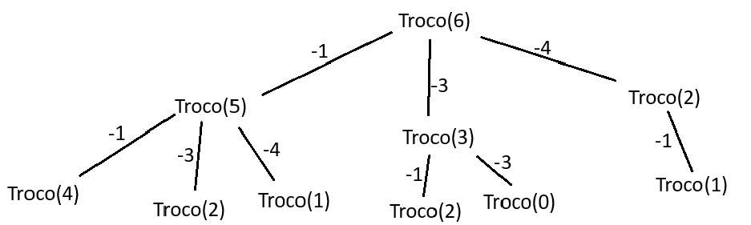

# CP5 Dynamic Programmig
## Integrantes:
<ul>
  <li>Pedro Henrique Mendes (RM 555332)</li>
  <li>Kayky Stiliano (RM 555148)</li>
</ul>

<br>

# 1. Introdução e Contextualização do Problema
## O Problema da Troca de Moedas (Coin Change Problem)
### Contextualização
O Problema da Troca de Moedas é um dos problemas clássicos da computação e da matemática aplicada, amplamente utilizado para ilustrar conceitos de recursão e programação dinâmica.

O objetivo principal é determinar a menor quantidade de moedas necessárias para formar um determinado montante (M), utilizando um conjunto de moedas com valores pré-definidos.

As premissas básicas são:
- Cada moeda possui um valor inteiro positivo (ex.: 1, 2, 5, 10...);
- Existe uma quantidade ilimitada de cada tipo de moeda disponível;
- O montante M a ser formado também é um número inteiro positivo;
- O resultado deve ser a quantidade mínima de moedas que somam exatamente o montante.
- Caso não seja possível formar o montante com as moedas disponíveis, a função deve indicar essa impossibilidade (por exemplo, retornando ```-1``` ou ```∞```).

### Exemplo ilustrativo
Suponha um conjunto de moedas ```moedas = [1, 3, 4]``` e um montante ```M = 6```.  
As possíveis combinações são:
- ```1 + 1 + 1 + 1 + 1 + 1 = 6``` → 6 moedas
- ```3 + 3 = 6``` → 2 moedas (ótima)
- ```4 + 1 + 1 = 6``` → 3 moedas

A solução ótima é a segunda opção, pois utiliza a menor quantidade de moedas.

---
### Natureza do Problema
O Coin Change é classificado como um Problema de Otimização, pois busca minimizar uma medida de custo — neste caso, o número total de moedas utilizadas.

O objetivo não é apenas encontrar uma combinação possível, mas sim a melhor combinação possível entre muitas alternativas.

Assim, entre todas as soluções válidas (que somam M), queremos aquela que minimiza o número de moedas utilizadas, o que o caracteriza como um problema de otimização combinatória.

---
## Definição de Programação Dinâmica (PD)
### Conceito
A Programação Dinâmica (PD) é uma técnica de resolução de problemas que se baseia na divisão de um problema complexo em subproblemas menores, resolvendo cada um apenas uma vez e armazenando seus resultados para uso posterior.

Essa técnica é aplicada quando:
- O problema pode ser dividido em subproblemas menores e independentes, e
- Esses subproblemas são reutilizados várias vezes ao longo do processo de resolução.

A PD tem dois pilares conceituais fundamentais: Subestrutura Ótima e Subproblemas Sobrepostos.

---
### Subestrutura Ótima

Um problema possui subestrutura ótima quando a solução ótima global pode ser construída a partir das soluções ótimas dos subproblemas menores.

No Coin Change, por exemplo:

>Para calcular o número mínimo de moedas para formar um valor M, basta conhecer o número mínimo de moedas para os valores ```M - moeda[i]``` (para cada moeda disponível).

Matematicamente:

$$f(M) = \min_{\text{moeda} \in \text{moedas}} (1 + f(M - \text{moeda}))$$

Ou seja, a melhor solução para ```M``` depende diretamente das melhores soluções para montantes menores — caracterizando a subestrutura ótima.

---
### Subproblemas Sobrepostos

Um problema apresenta subproblemas sobrepostos quando o mesmo subproblema é resolvido diversas vezes durante a execução do algoritmo.

No caso da versão recursiva do Coin Change:
- Para calcular ```f(6)```, é necessário ```f(5)```, ```f(3)``` e ```f(2)```.
- Para calcular ```f(5)```, também se calcula ```f(4)```, ```f(2)``` e ```f(1)```.
- Assim, ```f(2)``` e ```f(3)``` são recalculados múltiplas vezes — o que leva à explosão combinatória.

A Programação Dinâmica (PD) elimina essa redundância armazenando os resultados de cada subproblema em uma tabela (ou vetor ```dp```), de forma que, quando o mesmo subproblema for necessário novamente, o valor é apenas consultado, e não recomputado.

---
## Conclusão da Seção

O Problema da Troca de Moedas é um exemplo clássico de problema de otimização com subproblemas sobrepostos, o que o torna ideal para ser resolvido com Programação Dinâmica.
A abordagem recursiva simples é útil para compreensão conceitual, mas ineficiente.
Já a PD, seja Top-Down (com memoização) ou Bottom-Up (iterativa), fornece uma solução eficiente e escalável, garantindo o menor número de moedas de forma sistemática.

<br>

# 2. Análise Detalhada das Abordagens
## Função 1 - Iterativa (estratégia gulosa)
Explicação da lógica (passo a passo):
<ul>
  <li>Filtramos moedas inválidas (<=0) e garantimos que temos tipos válidos.</li>
  <li>Ordenamos as moedas em ordem decrescente (maior primeiro).</li>
  <li>Para cada moeda, pegamos a máxima quantidade inteira possível (qtd = restante // moeda) e subtraímos do restante.</li>
  <li>Continuamos até acabar as moedas ou o restante ficar zero.</li>
  <li>Se ao final restante == 0, retornamos o total de moedas; caso contrário, retornamos -1 (impossível).</li>
</ul>

Por que o algoritmo guloso não garante solução ótima?
A estratégia gulosa toma decisões locais (usar sempre a maior moeda possível naquele momento) sem considerar efeitos futuros. Em alguns sistemas de moedas (por exemplo, o sistema monetário canônico como [1,5,10,25] em que o guloso funciona para moedas típicas), o guloso produz sempre o ótimo. Porém, para conjuntos arbitrários de moedas, a escolha local ótima pode bloquear combinações melhores que usam mais moedas médias em vez de uma moeda grande + várias pequenas.
<br>
Caso de falha (ilustrado):
<ul>
  <li>Moedas: [1, 3, 4]</li>
  <li>Montante: M = 6</li>
</ul>
Passos do guloso:
<ul>
  <li>Ordena → [4, 3, 1]</li>
  <li>Usa uma moeda 4 (restante = 2)</li>
  <li>Não pode usar 3 → usa duas moedas 1 (restante = 0)</li>
  <li>Total moedas = 3 (4 + 1 + 1)</li>
</ul>
Solução ótima:
<ul>
  <li>Usa duas moedas 3 → total moedas = 2 (3 + 3)</li>
</ul>
Logo, guloso -> 3 moedas (pior), ótimo -> 2 moedas.
<br>
<br>
Observações finais:
<ul>
  <li>A função é simples e rápida para muitos casos práticos, e é uma boa heurística inicial.</li>
  <li>Deve-se sempre verificar se o conjunto de moedas é do tipo "canônico" (ou seja, um sistema onde o guloso é ótimo). 
  Para conjuntos arbitrários, usar PD (bottom-up) ou recursão com memoização (top-down) garante ótima solução.</li>
  <li>Retornei -1 quando é impossível formar o montante exatamente; outra opção seria float('inf') para uso interno, mas -1 é mais interpretável no output final.</li>
</ul>

## Função 2 - Recursiva Pura (sem memoização)
### Conceito

A abordagem recursiva pura resolve o problema da troca de moedas tentando todas as combinações possíveis de moedas.  
Para cada moeda disponível, o algoritmo chama a si mesmo recursivamente para resolver o subproblema de valor ```M - moeda```.

Ou seja:

>“Para formar o montante M, experimente usar cada moeda e veja qual combinação resulta no menor número total de moedas.”

A função é sem otimizações, ou seja, recalcula os mesmos subproblemas diversas vezes.

---
### Análise de Desempenho
#### Árvore de Recursão — Exemplo prático

Considere moedas = ```[1, 3, 4]``` e ```M = 6```.

A primeira chamada tenta todas as possibilidades:



Observe:
- O nó ```troco(3)``` aparece mais de uma vez (por exemplo, ao calcular ```troco(6)``` e ```troco(5)```).
- O mesmo ocorre com ```troco(2)``` e ```troco(1)``` — subproblemas sobrepostos.

Assim, a função recalcula repetidamente o mesmo resultado em ramos diferentes da árvore.

---
#### Reprocessamento dos Subproblemas

Por exemplo:
- ```troco(3)``` é resolvido várias vezes, embora o resultado seja sempre o mesmo.
- Se ```troco(3)``` levar 4 chamadas internas, e ele for invocado 5 vezes, já são 20 chamadas só para esse subproblema.

Esse reprocessamento é a principal causa da ineficiência.

---
#### Por que é Exponencial?

A cada chamada, o algoritmo abre novas ramificações iguais ao número de moedas disponíveis.
Logo, se temos n tipos de moedas e montante M, o número de chamadas pode crescer até cerca de:

$$O(n^M)$$

ou mais comumente representado como:

$$O(2^M)$$

Essa explosão combinatória ocorre porque o algoritmo não “lembra” resultados anteriores.

---
#### Conclusão Prática
- Vantagem: Implementação simples e direta.
- Desvantagem: Cresce exponencialmente → inaceitável para M > 30 (pode levar minutos ou horas).
- Complexidade:
    - Tempo: ```O(2^M)```
    - Espaço: ```O(M)``` (profundidade da recursão)

<br>

## Função 3 - Recursiva com Memoização (Top Down)
Explicação da lógica (passo a passo):
<ul>
  <li>A função tenta resolver o problema de formar o montante M a partir das moedas disponíveis, de forma recursiva: para cada moeda, ela tenta resolver o subproblema M - moeda.</li>
  <li>Caso M seja igual a zero, significa que conseguimos formar o valor exato — portanto, retornamos 0 (nenhuma moeda adicional necessária).</li>
  <li>Caso M seja negativo, quer dizer que passamos do valor desejado — retornamos ∞ (impossível formar).</li>
  <li>Antes de calcular novamente um subproblema, a função verifica se ele já foi resolvido anteriormente e guardado no dicionário memo.</li>
  <li>Se estiver no cache (memo), ela simplesmente reutiliza o resultado, sem recalcular.</li>
  <li>Caso contrário, a função chama-se recursivamente para todas as moedas possíveis, pega o menor resultado (menor número de moedas) e armazena esse valor no dicionário antes de retornar.</li>
</ul>

Conceito:
<br>
A Memoização é uma técnica que consiste em armazenar os resultados de subproblemas já resolvidos para evitar cálculos repetidos.
Na recursão pura, cada chamada pode recalcular os mesmos valores várias vezes (por exemplo, qtdeMoedas(4) pode ser resolvida repetidamente em diferentes ramos da árvore recursiva).
Com a memoização, esses resultados ficam salvos em um cache (dicionário memo), e sempre que o mesmo montante M é solicitado novamente, a função retorna o valor diretamente desse cache — sem refazer toda a recursão.
<br>

Ligação com a Programação Dinâmica (PD)
<br>
A recursão com memoização é considerada uma forma de Programação Dinâmica Top Down.
Isso acontece porque ela segue os dois princípios fundamentais da PD:
<ul>
  <li>Subestrutura ótima: o número mínimo de moedas para formar um montante M depende das soluções ótimas dos montantes menores (M - moeda);</li>
  <li>Subproblemas sobrepostos: muitos subproblemas são repetidos ao longo das chamadas recursivas (por exemplo, calcular qtdeMoedas(2) aparece em vários ramos).</li>
</ul>
A diferença para a PD Bottom-Up é apenas a direção da resolução:
<ul>
  <li>Top-Down (recursiva com memoização): resolve os subproblemas conforme são necessários, armazenando os resultados.</li>
  <li>Bottom-Up (iterativa): resolve todos os subproblemas de baixo para cima (de 0 até M), preenchendo uma tabela.</li>
</ul>

Melhoria na Eficiência:
<br>
Na recursão pura, o mesmo subproblema pode ser resolvido diversas vezes, o que causa reprocessamento exponencial.
Por exemplo, se queremos formar M = 6 com moedas [1, 3, 4], a chamada para qtdeMoedas(3) pode ocorrer várias vezes dentro da árvore recursiva.
<br>
Com a memoização, cada valor de M é calculado apenas uma vez e depois reaproveitado.
Isso transforma uma complexidade exponencial em uma quase linear em relação ao número de subproblemas possíveis.
O cache elimina a redundância e garante que cada subproblema contribua uma única vez para o resultado final.
<br>

Complexidade:
<br>
Tempo:
<ul>
  <li>𝑂(𝑀×𝑛)</li>
</ul>
Onde:
<ul>
  <li>'𝑀' é o montante alvo (quantidade de subproblemas possíveis);</li>
  <li>'𝑛' é o número de tipos de moedas.</li>
</ul>
Cada subproblema é resolvido apenas uma vez e, para cada um, percorremos todas as moedas disponíveis.
<br>
<br>
Espaço:
<ul>
  <li>O(M) devido ao dicionário de memoização e à pilha de recursão.</li>
</ul>
Melhor caso (Ω): 
<ul>
  <li>O(𝑛) — quando M = 0 ou quando todas as respostas já estão memorizadas.</li>
</ul>
Pior caso (O):
<ul>
  <li>𝑂(𝑀×𝑛) - quando precisamos calcular todos os subproblemas.</li>
</ul>
Caso médio (Θ): 
<ul>
  <li>𝑂(𝑀×𝑛)</li>
</ul>
<br>

## Função 4 - Usando Programação Dinâmica (Bottom up)
### Conceito

A Programação Dinâmica (PD) evita o reprocessamento criando um vetor auxiliar ```dp```, onde:

>```dp[i]``` representa a menor quantidade de moedas necessárias para formar o montante ```i```.

Assim, cada resultado é calculado apenas uma vez e armazenado para uso posterior.

---
### O que o vetor dp armazena

Exemplo: ```moedas = [1, 3, 4]``` e ```M = 6```

| i (montante) | dp[i] (menor nº de moedas) | Combinação possível |
|:------------:|:--------------------------:|:-------------------:|
| 0            | 0                          | -                   |
| 1            | 1                          | [1]                 |
| 2            | 2                          | [1, 1]              |
| 3            | 1                          | [3]                 |
| 4            | 1                          | [4]                 |
| 5            | 2                          | [4, 1]              |
| 6            | 2                          | [3, 3]              |

O vetor cresce de baixo para cima, calculando do ```dp[0]``` até ```dp[M]```.

---
### Fluxo do Algoritmo (Construção Iterativa)

Para cada valor ```i``` de ```1``` até ```M```, o algoritmo:
1. Percorre todas as moedas disponíveis.
2. Se a moeda for menor ou igual a ```i```, verifica ```dp[i - moeda] + 1```.
3. Guarda o mínimo encontrado em ```dp[i]```.

Assim:
>A solução para ```i``` depende das soluções já calculadas para montantes menores ```(i - moeda)```.

---
### Vantagem sobre o Top-Down (com memoização)
- Top-Down (Recursivo com cache): ainda faz chamadas recursivas → maior sobrecarga de pilha e chamadas de função.
- Bottom-Up (Iterativo): calcula tudo em laço simples → mais rápido na prática, pois evita recursões e chamadas de função.

Para grandes valores de ```M```, o Bottom-Up costuma ter melhor desempenho constante (menor overhead).

---
### Complexidade
- **Tempo**:  
Cada valor ```i``` (de 1 a M) testa todas as ```n``` moedas →  
$$O(M×n)$$
- **Melhor caso**:  
Mesmo que existam moedas que coincidam exatamente com o valor, ainda percorremos o vetor →
$$Ω(M×n)$$
- **Espaço**:  
Apenas um vetor de tamanho ```M + 1``` →
$$O(M)$$

---
### Conclusão Prática
| Critério                | Recursiva Pura       | Programação Dinâmica (Bottom-Up) |
| ----------------------- | -------------------- | -------------------------------- |
| Reprocessa subproblemas | Sim                  | Não                              |
| Complexidade de tempo   | Exponencial `O(2^M)` | Linear em M e n → `O(M×n)`       |
| Espaço                  | O(M)                 | O(M)                             |
| Escalabilidade          | Fraca                | Excelente                        |
| Indicado para           | Ensino/Teoria        | Aplicações reais                 |

<br>

# 3) Conclusão
Resumo Comparativo das Abordagens
<br>
| **Abordagem** | **Tipo de Implementação**           | **Estratégia**                               | **Complexidade de Tempo (O)** | **Complexidade Melhor Caso (Ω)** | **Complexidade Média (Θ)** | **Ótima em Todos os Casos?** |
| ------------- | ----------------------------------- | -------------------------------------------- | ----------------------------- | -------------------------------- | -------------------------- | ---------------------------- |
| **Função 1**  | Iterativa                           | Estratégia Gulosa                            | O(n log n)                    | Ω(n)                             | Θ(n)                       | ❌ Não                        |
| **Função 2**  | Recursiva Pura                      | Exploração Total (Brute Force)               | O(2^M)                        | Ω(M)                             | Θ(2^M)                     | ✅ Sim (mas ineficiente)      |
| **Função 3**  | Recursiva com Memoização (Top-Down) | Programação Dinâmica (cache de subproblemas) | O(M × n)                      | Ω(n)                             | Θ(M × n)                   | ✅ Sim                        |
| **Função 4**  | Programação Dinâmica (Bottom-Up)    | Tabela iterativa (resolução incremental)     | O(M × n)                      | Ω(M × n)                         | Θ(M × n)                   | ✅ Sim                        |

🔹 n: número de tipos de moedas
🔹 M: montante a ser formado

Escolha Ótima:
<br>
A abordagem mais eficiente e robusta para resolver o Problema da Troca de Moedas é a Programação Dinâmica (Bottom-Up).
<ul>
  <li>Assim como a versão com memoização (Top-Down), ela garante o resultado ótimo em todos os casos.</li>
  <li>No entanto, a versão Bottom-Up evita a sobrecarga de chamadas recursivas e o custo de gerenciamento da pilha, o que a torna ligeiramente mais rápida e mais estável para grandes valores de M.</li>
  <li>Em contrapartida, a versão Top-Down é mais intuitiva e fácil de implementar, sendo excelente para aprendizado e análise conceitual da técnica.</li>
</ul>

Portanto, a Função 4 (PD Bottom-Up) representa o melhor equilíbrio entre eficiência, previsibilidade e escalabilidade.

Reflexão Final:
<br>
O Problema da Troca de Moedas é um exemplo clássico de problema de otimização com subestrutura ótima e subproblemas sobrepostos — características fundamentais para a aplicação de Programação Dinâmica (PD).
A PD permite transformar algoritmos exponenciais e ineficientes em soluções polinomiais, por meio do armazenamento e reaproveitamento de resultados parciais.
Essa técnica elimina o reprocessamento redundante e garante soluções ótimas em tempo viável, mesmo para entradas grandes.
Mais do que uma ferramenta matemática, a Programação Dinâmica representa uma forma de pensar sistematicamente: quebrar um grande problema em partes menores, resolver cada parte de maneira ótima e combinar essas soluções para formar a resposta global.
